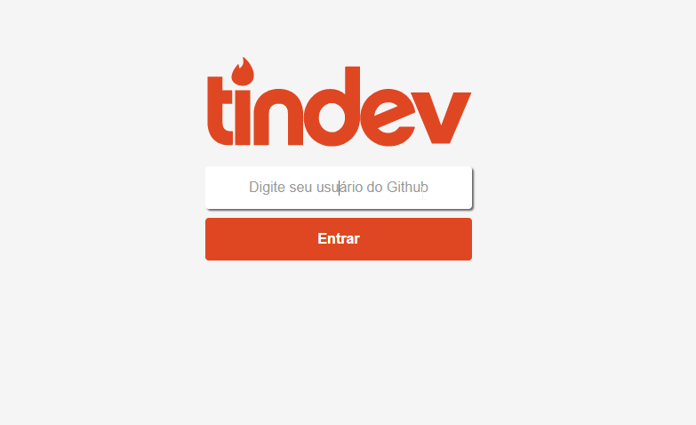
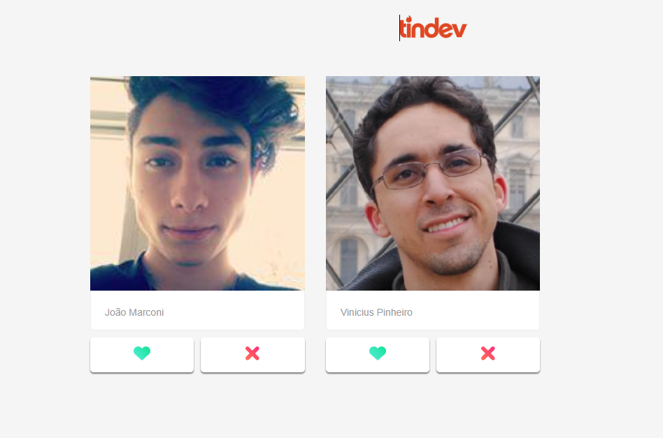
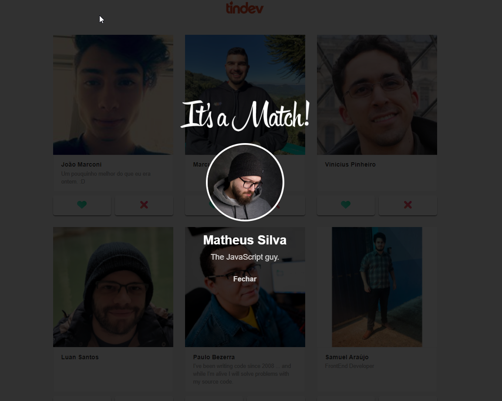

Projeto desenvolvido com base nas aulas do evento Semana OmniStack 8.0, oferecido pela Rocketseat. A ideia do projeto é reproduzir minimamente as funcionalidades e interface do Tinder. Tendo como único propósito, o aprendizado de novas tecnologias para desenvolvimento de software.

Tecnologias:
     React.js
     
 Screenshots:

<h2>Tela de Login</h2>

<h2>Dashboard</h2>

<h2>Matching</h2>

